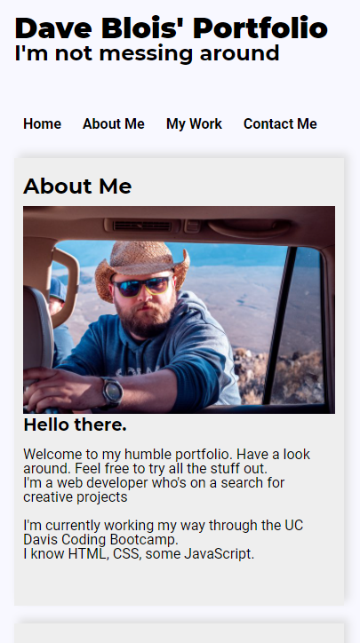

# The Portfolio Assignment

Hello again.
This is the first version of my portfolio.
My eyes were bigger than my stomach upon taking it on and I wasn't able to add every feature I wanted to, but I think I got the important things up and running.

## Here it is on a standard monitor/laptop

## Here it is in mobile

i.e. it's responsive, it has my "projects" laid out in a flexbox grid, where the top one is twice the width of the ones underneath it, you see my name, a recent photo, and links to sections about me, my work, and how to contact me, links scroll you down to the corresponding section, if you click on the top one you are taken to the corresponding page.

But I did have time to add a little flair here and there. But, I'm not a designer.
 Anywho...
 here's a link.
[My Portfolio](https://davebloisesquire.github.io/animated-happiness/)
